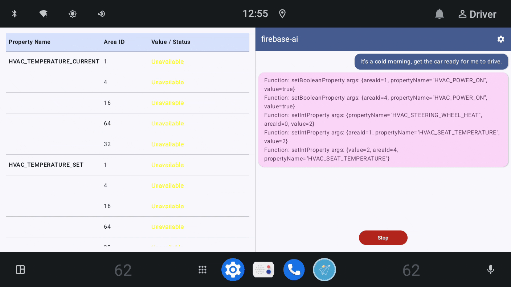
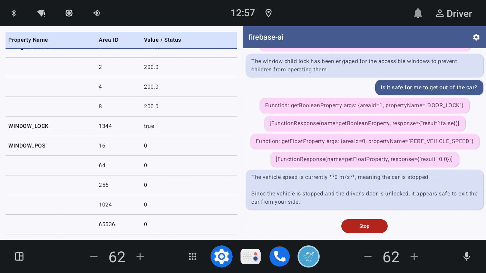

# 🛝Car Tool Playground

By empowering a Large Language Model (LLM) with [CarToolForge](https://github.com/autoharness/CarToolForge), the Car Tool Playground showcases how an LLM can interact with vehicle functions through a conversational chat interface.





## Features

- **Free Chat:** Engage in an open-ended conversation with the LLM.
- **Auto Play:** Run a scripted, multi-turn conversation from a pre-configured dataset.

## Prerequisites

**1. Install CarToolForge**

Follow the [CarToolForge installation guide](https://github.com/autoharness/CarToolForge?tab=readme-ov-file#installation).

**2. Set up a Firebase project**

This project uses [Firebase AI Logic](https://firebase.google.com/docs/ai-logic) to make calls to the Gemini API. You'll need to create a Firebase project in the [Firebase console](https://console.firebase.google.com) and register this app with it.

For detailed instructions, see [Step 1: Set up a Firebase project and connect your app](https://firebase.google.com/docs/ai-logic/get-started?api=dev#set-up-firebase).

After configuration, download the generated `google-services.json` file and place it in the project's `app/` directory. If this file is missing, the build will fail with the following error:

```
Execution failed for task ':app:processDebugGoogleServices'.
> File google-services.json is missing.
```

> [!TIP]
>
> It is highly recommended to build and run the [AppFunctionsPilot](https://github.com/FilipFan/AppFunctionsPilot) and [firebase-ai](https://github.com/firebase/quickstart-android/tree/master/firebase-ai) sample projects first. This will help you familiarize yourself with the dependencies and potentially save debugging time.

## Build

You can build the project using Gradle:

```
./gradlew clean assembleDebug
```

## Installation

The app requires privileged permissions to access vehicle properties and execute function calls. To install it, you'll need a rooted device or emulator.

1. **Disable Permission Enforcement:** First, modify the `build.prop` file to disable privileged permission enforcement.

```
adb root
adb remount
adb shell "sed -i 's/ro.control_privapp_permissions=enforce/ro.control_privapp_permissions=log/g' /vendor/build.prop"
```

2. **Install as a Privileged App:** Push the APK to the privileged apps directory, such as `/system/priv-app`:

```
adb push app-debug.apk /system/priv-app
adb reboot
```

3. **Grant Runtime Permissions:** To simplify development (a admittedly bad practice 😜), the app skips runtime permission requests. Instead, using `adb install -g` to directly grant all necessary runtime permissions:

```
adb install -g app-debug.apk
```

> [!NOTE]
>
> After the initial privileged installation, you can update the agent app using a standard `adb install` command, provided its permissions in the manifest do not change.

## Large Language Model

**Firebase AI Logic** is currently integrated. For a list of available models, see [Learn about supported models](https://firebase.google.com/docs/ai-logic/models). The specific model utilized can be changed in [`FirebaseInference.kt`](app/src/main/java/org/autoharness/cartoolplayground/inference/firebase/FirebaseInference.kt).

## Dataset

The dataset for **Auto Play** mode can be found in the [`test_set.csv`](app/src/main/assets/dataset/test_set.csv). You can edit this file to customize the conversational script.

## Contributing

Take a look at the [`CONTRIBUTING.md`](CONTRIBUTING.md).

## References

- [Firebase AI Logic](https://firebase.google.com/docs/ai-logic)
- [AppFunctionsPilot](https://github.com/FilipFan/AppFunctionsPilot)
- [PolyEngineInfer](https://github.com/FilipFan/PolyEngineInfer)
